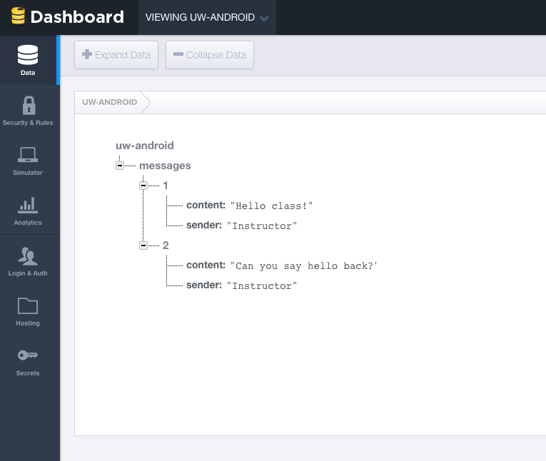
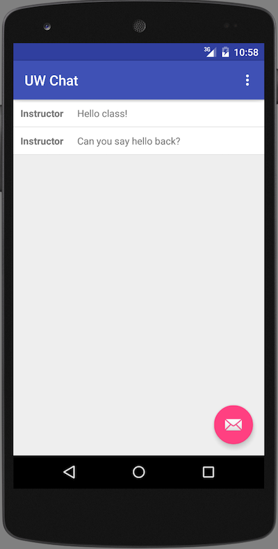

# What is Firebase?

Firebase is a "backend as a service" owned by Google. It provides a real-time database and API that allows developers to store and sync data across multiple clients.

# What problem does it solve?

Let's say you want to build an application that provides live updates. For instance, you may want to create a Twitter-like activity stream or build an app with live sports scores. You want to view the application on the web and mobile devices, including Android and iOS. When the application's data is updated, you want all of the devices that are displaying that data to see the change reflected on their screen immediately.

With a standard web application or Android app, you would have to do one of two things for end users to see the updated data:

1. The user would have to refresh the webpage or reload the ListView Activity on their Android app
2. You would set a timer or interval to poll a Web API to check if there is new data to fetch, then re-render the screen.

# How does Firebase handle real-time data?

Firebase stores data as JSON objects. When using Firebase, your data is a big collection of nested key-value pairs. It is probably best to learn how this works by actually creating a Firebase account and using its built-in database browser. So let's create an account by visiting the <a href="https://firebase.com">Firebase website</a> and signing in with Google. Once you are signed in you can create a new app where your data will live as shown in the screenshot below:


Note: Initially, everyone in class should create their own database. However, in our activity later on, everyone in class should use the URL above for the database. 

Once you have created an application database in Firebase, you can browse your data using a web interface on the Firebase website. You can use this interface to add new key-value pairs to the database. Experiment with creating new objects in the tree to form the structure below. Click on some of the objects and make note of how the URL changes. 



When the users of your application are on a particular screen, your Activity will connect to the key value store on a particular node. Firebase provides a set of "listeners" for your list views so that you can listen for updates on that node. When anyone pushes new data to that node, this information is pushed to all other listeners on that node, and the ListView automatically updates without needing to refresh the screen. Let's try this out.

# Connecting an Android Application to Firebase

## Create a new Android Project

First you need to create a new project in Android Studio. I picked Drawer navigation, but you can start with an empty project or ListView if you prefer. Our application will look like the screenshot below. All of the messages in our Firebase datastore will be displayed in a ListView. Anyone connected to the same datastore will be able to click the Floating Action Button and push a chat message to the datastore. All devices connected to the Firebase datastore will have a ListView that is synchronized to the data in the messages node.



## Add Dependencies

Once you have created an Android project, you need to add the Firebase dependencies to your gradle build file. Once your grade file syncs, this will allow you to import the necessary Firebase packages into your Java code.

```
dependencies {
    compile fileTree(dir: 'libs', include: ['*.jar'])
    testCompile 'junit:junit:4.12'
    compile 'com.firebase:firebase-client-android:2.4.0'
    compile 'com.firebaseui:firebase-ui:0.2.2'
    compile 'com.android.support:appcompat-v7:23.1.1'
    compile 'com.android.support:design:23.1.1'
}
```

Also, add the following lines to your packingOptions:

```
packagingOptions {
    exclude 'META-INF/LICENSE'
    exclude 'META-INF/NOTICE'
}
```

If you don't do this, you will get the following error:

```
Error:Execution failed for task :app:transformResourcesWithMergeJavaResForDebug.
> com.android.build.api.transform.TransformException: com.android.builder.packaging.DuplicateFileException: Duplicate files copied in APK META-INF/NOTICE
```

## Permissions

Connecting to Firebase requires an Internet connection, so be sure to add the INTERNET permission to your AndroidManifest.xml file. 

```
<uses-permission android:name="android.permission.INTERNET" />
```

## 

package com.androidclass.uwchat.util;

public class Constants {
    public static final String FIREBASE_URL = "https://uw-android.firebaseio.com";
}


## MainActivity

```
package com.androidclass.uwchat;

import android.content.DialogInterface;
import android.os.Bundle;
import android.support.design.widget.FloatingActionButton;
import android.support.v7.app.AlertDialog;
import android.support.v7.app.AppCompatActivity;
import android.support.v7.widget.Toolbar;
import android.view.View;
import android.view.Menu;
import android.view.MenuItem;
import android.widget.EditText;
import android.widget.ListView;

import com.androidclass.uwchat.models.Message;
import com.androidclass.uwchat.util.Constants;
import com.firebase.client.Firebase;

import java.util.HashMap;
import java.util.Map;

public class MainActivity extends AppCompatActivity {

    private Firebase uwChatReference;
    private MessageListAdapter messageListAdapter;
    private ListView messageListView;
    private String messageContentText = "";

    @Override
    protected void onCreate(Bundle savedInstanceState) {
        super.onCreate(savedInstanceState);
        setContentView(R.layout.activity_main);

        Toolbar toolbar = (Toolbar) findViewById(R.id.toolbar);
        setSupportActionBar(toolbar);

        /**
         * Initialize the Firebase library
         * Create Firebase object referencing the database URL, connect to messages child node
         */
        Firebase.setAndroidContext(this);
        uwChatReference = new Firebase(Constants.FIREBASE_URL).child("messages");

        /**
         * Get a reference to the list view in the android layout
         */
        messageListView = (ListView) findViewById(R.id.message_list);

        /**
         * Set up the list adapter, controls how messages are displayed in the message list
         * note we pass in the reference to the firebase messages, this list adapter extends a
         * special FirebaseListAdapter that accepts a POJO model class that maps Firebase key values
         * to a Java object for display in your Android layouts
         */
        messageListAdapter = new MessageListAdapter(this, Message.class, R.layout.message, uwChatReference);
        messageListView.setAdapter(messageListAdapter);

        /**
         * Our activity came with a floating action button, let's use this to add a message
         */
        FloatingActionButton fab = (FloatingActionButton) findViewById(R.id.fab);
        fab.setOnClickListener(new View.OnClickListener() {
            @Override
            public void onClick(View view) {
                // let's use an alert dialog and some text inputs for our message form
                AlertDialog.Builder builder = new AlertDialog.Builder(view.getContext());
                builder.setTitle("Send a Message");

                // Set up the inputs
                final EditText messageContentView = new EditText(view.getContext());
                builder.setView(messageContentView);

                // Set up the buttons
                builder.setPositiveButton("OK", new DialogInterface.OnClickListener() {
                    @Override
                    public void onClick(DialogInterface dialog, int which) {
                        // when the user submits, let's get the text from the input
                        messageContentText = messageContentView.getText().toString();

                        // let's push this input into Firebase
                        Map<String, String> message = new HashMap<String, String>();
                        message.put("content", messageContentText);
                        message.put("sender", "The class");
                        uwChatReference.push().setValue(message);
                    }
                });

                // user clicks cancel, don't send anything
                builder.setNegativeButton("Cancel", new DialogInterface.OnClickListener() {
                    @Override
                    public void onClick(DialogInterface dialog, int which) {
                        dialog.cancel();
                    }
                });

                builder.show();
            }
        });
    }

    @Override
    public boolean onCreateOptionsMenu(Menu menu) {
        // Inflate the menu; this adds items to the action bar if it is present.
        getMenuInflater().inflate(R.menu.menu_main, menu);
        return true;
    }

    @Override
    public boolean onOptionsItemSelected(MenuItem item) {
        // Handle action bar item clicks here. The action bar will
        // automatically handle clicks on the Home/Up button, so long
        // as you specify a parent activity in AndroidManifest.xml.
        int id = item.getItemId();

        //noinspection SimplifiableIfStatement
        if (id == R.id.action_settings) {
            return true;
        }

        return super.onOptionsItemSelected(item);
    }
}
```

## MessageListAdapter

```
package com.androidclass.uwchat;

import android.app.Activity;
import android.view.View;
import android.widget.TextView;

import com.androidclass.uwchat.models.Message;
import com.firebase.client.Query;
import com.firebase.ui.FirebaseListAdapter;

public class MessageListAdapter extends FirebaseListAdapter<Message> {

    public MessageListAdapter(Activity activity, Class<Message> modelClass, int modelLayout, Query messageListReference) {
        super(activity, modelClass, modelLayout, messageListReference);
        this.mActivity = activity;
    }

    @Override
    protected void populateView(View view, final Message message, int position) {
        TextView messageSenderView = (TextView) view.findViewById(R.id.message_sender);
        TextView messageContentView = (TextView) view.findViewById(R.id.message_content);

        messageSenderView.setText(message.getSender());
        messageContentView.setText(message.getContent());
    }
}
```


Firebase.setAndroidContext(this);


Add a reference to the node. Demo to everyone in the class who is connected. We should be able to push messages to each other.


Reading data

myFirebaseRef.child("message").addValueEventListener(new ValueEventListener() {
  @Override
  public void onDataChange(DataSnapshot snapshot) {
    System.out.println(snapshot.getValue());  //prints "Do you have data? You'll love Firebase."
  }
  @Override public void onCancelled(FirebaseError error) { }
});

http://g.recordit.co/AVc2y2TrjI.gif

Writing data

send a message using the FAB button

    myFirebaseRef.child("message").setValue("Do you have data? You'll love Firebase.");

As you can see, Firebase gives us a big reward for not much effort by taking care of the backend. We didn't need to write our own web backend, run a server, write any AsyncTasks to hit our web backend, or parse any XML or JSON. And since it is run by Google, we can trust that it is a reliable, scalable solution. Unless they kill the product all together :).

# Locking it down.

That was easy, almost too easy. Surely there is a catch. Well notice that everyone in the class could connect to the database url without any authorization? They can also write back to it. By default, the door is wide open.

What to do? Firebase provides a set of rules for locking down these URLs. That is left as an exercise for the student :). (unless I have time to write this out today).

# Web Access

React + ReactFire sample code + demo.

# Links to more resources

* link 1
* link 2
* link 3

# Exercises

[ include one or more assignments ]
